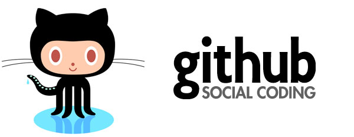
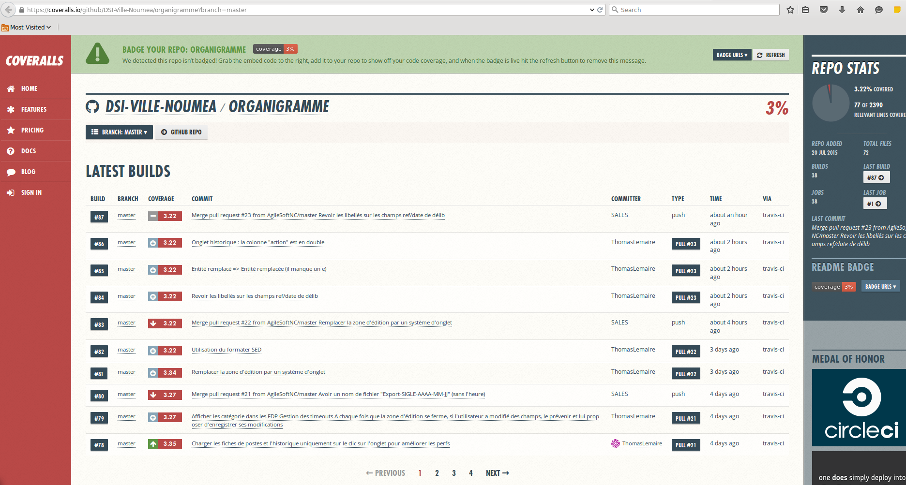

title: Développer dans le cloud en 1 WE
output: presentation-idd-cloud.html
author:
  name: Adrien Sales
  twitter: rastadidi
  github DSI : https://github.com/DSI-Ville-Noumea
  url: http://adriens.github.io/
controls: true

--
# Développer dans le cloud en 1 WE
## Open source code, intégration/tests continus, packaging, déploiement
### SALES Adrien, DSI Ville de Nouméa

--
# Contexte
## Projet Gestion des Organigrammes

* Utilisation de [ZK](http://www.zkoss.org)
* Un incident
* Besoin commun SED/SIE de repos. git
* Collaboration prestation externe
* Industrialisation du dev en pause faut de dispo infra

--
# Contexte
## Culture 1/2

* Uniquement des composants open source sous linux
* Une présentation sur l'écosystème "cloud"
* Volonté de se concentrer sur nos métiers
* Tout sous maven

--
# Contexte
## Culture 2/2

* Une culture de dev déja solidement établie chez certains (pro et perso)
* Collaboration déja en cours sur [github](https://github.com/) des logiciels
que nous utilisons (liquibase, schemacrawler, modules puppet, ...)

--
# Challenge du vendredi (soir)

> Adrien, il faut publier le code source (très) rapidement en open et ouvert à tous
rapidement afin de disposer de la license [ZOL](http://www.zkoss.org/license#zol)

--
# Opportunités 1/2

* le travail de fondations effectuée depuis 5 ans
* des compétences non encore utilisées
* dynamiser le développement
* pousser la collaboration à un autre niveau
* disposer d'une infra./services exceptionnels

--
# Opportunités 2/2

* être plus près du code des partenaires qui sont déja sur git et poussent
sur notre svn (subversion)

--

--

> There are 10.3M people collaborating right now across 25.2M repositories on GitHub. Developers from all around the world are building amazing things together. Their story is our story.

--

# Le départ 1/3
## Source code/github.com

* git ?
* gestion décentralisée ?
* github.com ?
* Départ sur github
* Ecosystème github (services)

--
# Le départ 2/3
## Ecosystème git/github

* Changement organisationnel
* Le partage, tout de suite !
* Disponibilité
* Le GMail des développeurs

--
# Le départ 3/3
## Efficacité

* Bascule svn/git effectuée en 5'
* Collaboration/fork disponible dans la minute

--

## Sensations...

--
# Autour et après ?
## Builder, tester, intégrer, partager, devops

--
#### Toute ressemblance ...

--
## Le build continu
* travis-ci.org
* coût 0 pour open source
* des builds tournés sur des serveurs (3 Go de RAM) montés à la demande via docker
* création de bases de données (postgres, ...) à la volée pour les tests
* se lance au commit
* encrytpion des données perso
* la console
* languages : java, puppet, python, ruby,  ...
* aperçu sur la qualité des PR intégrée à github

--
## Aperçu projet Github

--
## Aperçu Couverture du code

--
## Aperçu build Travis

--
## Aperçu Pull Request

--
## Aperçu Intégration Slack

--
## Démo (Live !)

* Aperçu projet github
* Présentation shield et fichier Travis
* Modif de code
* Ouverture de Slack
* Création de la PR
* Réception PR Merge
* Merge
* Monitoring build Travis
* Revue activité slack

--
## Reste à faire

* Uploader les artefacts sur la repo centrale nexus depuis Travis
* Intégrer les checks de qualité de code

--
### Outils

* [Atom](https://atom.io/)
* https://github.com/jdan/cleaver
* github
* cleaver
* FF/Chrome

--
### Questions/Réponses
